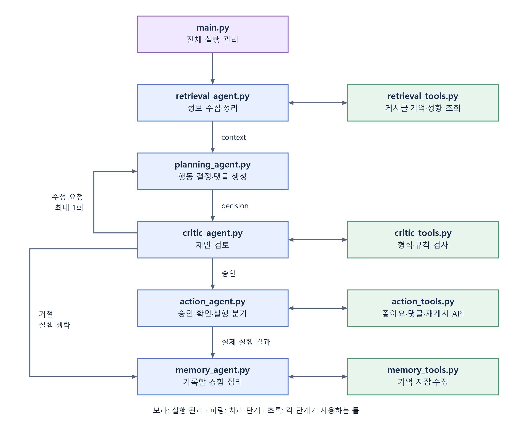

현재 파일들은 **게시글 하나를 보고 반응하는 과정을 역할별로 나눠 놓은 설계 틀**입니다. PlanningAgent는 예시 구현을 완료했고, 나머지 에이전트와 전체 연결은 TODO 상태입니다.

PlanningAgent 예제는 저장소 루트에서 다음 순서로 실행합니다.

```powershell
python -m pip install -r agents/requirements.txt
python -m agents.planning_example
```

프로젝트 루트 `.env`의 `GEMINI_API_KEY`를 자동으로 읽어 실제 Gemini를 호출합니다.
이미 설정된 환경변수가 있으면 `.env`보다 우선합니다. 키는 Git에 커밋하지 않습니다.
기본 모델은 `gemini-2.5-flash`이며 `.env`의 `GEMINI_MODEL`로 변경할 수 있습니다.
모델 호출은 `agents/gemini_model.py`의 `gemini_model_call`에서 담당합니다.
키 없이 고정 응답으로 확인하려면 `python -m agents.planning_example --mock`을 사용하세요.
실제 Gemini 실행도 행동 제안만 생성하며 댓글을 등록하거나 Spring 서버를 호출하지 않습니다.
설정 참고: https://googleapis.github.io/python-genai/
`agents/__init__.py`에서 클래스를 공개하므로 `from agents import PlanningAgent`로 가져옵니다.
`PlanningAgent(model_call=호출함수)`에 전달하는 함수는 `(system_prompt, input_json)`을 받고 JSON 문자열 또는 dict를 반환해야 합니다.
`run(context, feedback=None)`은 제안을 반환하며, 조회 오류·잘못된 모델 응답은 예외로 전달합니다.
재계획 횟수 제한과 Critic/Action 연결은 통합 담당의 `main.py`에서 구현합니다.

파일을 이해할 때는 세 가지를 구분하면 됩니다.

| 파일 종류 | 맡은 책임 |
|---|---|
| `*_agent.py` | 해당 단계에서 어떤 정보를 받아 무엇을 처리하고 반환할지 |
| `tools/*_tools.py` | 조회·검증·등록·저장 같은 구체적인 기능 |
| `main.py`, `tools/__init__.py` | 단계의 실행 순서와 사용할 툴 연결 |

`Agent`라고 이름 붙였지만, 현재 설계에서 모든 파일이 독립적으로 판단하는 AI는 아닙니다. 수집·실행·기록은 일반 Python 코드로 구현해도 됩니다.

**전체 실행 흐름**



화살표는 데이터 흐름입니다. **앞 단계가 다음 에이전트를 직접 호출하도록 만들 필요는 없고, `main.py`가 결과를 받아 다음 단계에 전달하는 구성**입니다.

---

**① `retrieval_agent.py` — 필요한 정보를 모아서 정리하는 파일**

게시글이 노출되면 처음 실행하는 단계입니다.

예를 들어 입력으로 다음 정보가 들어옵니다.

```text
어떤 실험인가: simulation-1
누가 보는가: participant-7
어떤 글인가: post-20
이번 노출은 무엇인가: exposure-100
```

이 파일은 세 가지 조회 기능을 사용합니다.

| `retrieval_tools.py`의 함수 | 가져오는 정보 |
|---|---|
| `get_post` | 게시글 본문과 작성자 |
| `search_memories` | 해당 참여자의 관련 기억 |
| `get_profile_and_relationship` | 참여자 성향과 작성자와의 관계 |

그 결과를 `context`라는 묶음으로 정리합니다.

```text
context
├── 게시글: "동네 도서관 운영 시간이 늘었습니다."
├── 성향: 독서를 좋아하고 주말에 도서관을 이용함
├── 기억: 이전에도 운영 시간에 관심을 보였음
└── 관계: 작성자와 특별한 관계 없음
```

여기서 두 파일의 차이는 다음과 같습니다.

- `retrieval_tools.py`: **정보를 실제로 가져오는 함수**를 구현합니다.
- `retrieval_agent.py`: **어떤 조회를 호출하고, 결과를 어떻게 묶고, 조회 실패 시 어떻게 처리할지** 구현합니다.

따라서 DB 조회나 HTTP 요청을 에이전트 파일에 모두 작성할 필요가 없습니다.

**② `planning_agent.py` — 어떻게 반응할지 결정하는 파일**

앞에서 만든 `context`를 받아 LLM에 전달하고 행동을 제안합니다.

구현할 내용은 다음과 같습니다.

- 게시글·성향·기억을 프롬프트로 구성합니다.
- `LIKE`, `COMMENT`, `REPOST`, `SKIP` 중 하나를 선택하게 합니다.
- 댓글을 선택했다면 댓글 본문도 생성합니다.
- 모델 응답을 정해진 데이터 형식으로 정리합니다.

예시 출력은 다음과 같습니다.

```text
decision
├── 행동: COMMENT
├── 대상: post-20
├── 내용: "주말에도 연장 운영하나요?"
└── 이유: 주말 이용에 관심이 있는 참여자이기 때문
```

**이 시점에는 댓글이 등록된 것이 아닙니다. 댓글을 달겠다는 제안만 만든 것입니다.**

현재 `planning_tools.py`가 없는 이유도 여기에 있습니다. 첫 설계에서는 정보를 이미 전달받으므로 추가 조회 툴이 필요 없고, LLM 호출로 행동을 결정하면 됩니다.

**③ `critic_agent.py` — 제안을 검토하는 파일**

Planning이 만든 제안과 원래 `context`를 함께 받습니다.

검사는 두 종류로 나눕니다.

| 검사 종류 | 구현 위치 | 예시 |
|---|---|---|
| 명확한 규칙 검사 | `critic_tools.py` | 댓글이 비었는지, 행동 종류가 유효한지, 대상 게시글이 맞는지 |
| 문맥에 대한 검토 | `critic_agent.py`에서 필요시 LLM 사용 | 게시글과 관련된 반응인지, 설정한 성향과 일관되는지 |

`critic_tools.py`의 `validate_action`은 정해진 규칙의 검사 결과를 반환합니다. `critic_agent.py`는 그 결과와 필요한 문맥 검토를 종합해 다음 중 하나를 반환합니다.

```text
APPROVE → 실행해도 됨
REVISE  → 이런 부분을 수정해서 다시 제안할 것
REJECT  → 실행하지 않을 것
```

예를 들어 COMMENT를 골랐는데 본문이 비었다면 수정 요청을 합니다.

이때 **다시 Planning으로 보낼지, 수정 횟수를 넘었으니 종료할지는 `main.py`가 관리**합니다.

**④ `action_agent.py` — 승인된 행동을 실행하는 파일**

검토 결과와 행동 제안을 받아 실제 실행을 관리합니다.

이 파일에서는 다음을 처리합니다.

- 지금 실행할 제안이 실제로 승인된 제안인지 확인합니다.
- 선택된 행동에 맞는 툴을 호출합니다.
- 실행 결과를 성공·실패·불명확으로 구분합니다.
- `SKIP`이면 API를 호출하지 않습니다.

구체적인 API 호출은 `action_tools.py`에 구현합니다.

| 행동 | 호출할 함수 |
|---|---|
| LIKE | `like_post` |
| COMMENT | `create_comment` |
| REPOST | `repost_post` |
| SKIP | 호출 없음 |

예를 들어:

```text
action_agent.py
  “COMMENT가 승인됐으니 create_comment를 호출한다.”
       ↓
action_tools.py의 create_comment
  “서버에 post-20과 댓글 본문을 보내 등록한다.”
```

**승인 확인과 행동 분기는 에이전트 파일, HTTP 요청과 서버 응답 처리는 툴 파일**에 두는 것입니다.

현재 서버의 좋아요·댓글·재게시 API는 추가 구현이 필요하므로, 이 부분은 API 명세를 맞춘 뒤 연결해야 합니다.

**⑤ `memory_agent.py` — 이번 경험을 기록하는 파일**

실제 실행 결과를 받아 다음에 참고할 기억을 구성합니다.

예를 들어 다음처럼 기록할 수 있습니다.

```text
participant-7은 도서관 운영 시간 게시글을 보고
"주말에도 연장 운영하나요?"라는 댓글을 등록했다.
실행 결과: 성공
```

두 파일의 역할은 다음과 같습니다.

- `memory_agent.py`: **무엇을 기억으로 남길지 정리**합니다.
- `memory_tools.py`: **그 기억을 실제 저장소에 저장하거나 수정**합니다.

사용할 함수는 다음 두 개입니다.

| 함수 | 역할 |
|---|---|
| `save_memory` | 새로운 경험 저장 |
| `update_memory_result` | 성공 여부가 불명확했던 결과를 나중에 보정 |

Planning에서 댓글을 제안했어도 등록이 실패했다면, “댓글을 달았다”라고 기억하면 안 됩니다. 그래서 이 단계는 **계획뿐 아니라 실제 실행 결과도 받습니다.**

또한 기억 저장이 실패했다고 댓글 등록을 다시 실행하면 안 됩니다. 기록 저장만 재시도해야 합니다.

저장한 기억은 다음 노출 때 이렇게 이어집니다.

```text
memory_tools.py의 save_memory
           ↓
       기억 저장소
           ↓
retrieval_tools.py의 search_memories
           ↓
  다음 행동 판단에 참고
```

**⑥ `tools/__init__.py` — 각 파일의 툴을 모아 제공하는 파일**

말씀하신 **import 선언문이 많이 모이는 파일**이 이것입니다.

담당자가 각 툴 파일에 함수를 구현하면, 여기에서 가져옵니다.

```python
from .retrieval_tools import get_post, search_memories, get_profile_and_relationship
from .critic_tools import validate_action
from .action_tools import like_post, create_comment, repost_post
from .memory_tools import save_memory, update_memory_result
```

그다음 어느 단계에서 사용할지 묶습니다.

```python
tool_groups = {
    "retrieval": [get_post, search_memories, get_profile_and_relationship],
    "critic": [validate_action],
    "action": [like_post, create_comment, repost_post],
    "memory": [save_memory, update_memory_result],
}
```

여기서 중요한 점은 세 가지입니다.

- `import`는 다른 파일에 정의한 함수를 가져오는 것입니다.
- `tool_groups`는 우리가 정한 일반 Python 딕셔너리입니다.
- **둘 다 함수를 실행하거나 LLM에 자동 연결해 주지는 않습니다.**

이 파일을 공통 등록 위치로 사용하기로 정한 것이지, Python에서 툴을 반드시 이렇게 연결해야 하는 것은 아닙니다. 각 에이전트가 직접 import하는 방식도 가능합니다. 지금은 팀원들이 **“완성한 툴을 어디에 추가해야 하는지” 한곳에서 확인하도록** 모았습니다.

현재 위 예시도 파일 안에서는 주석 상태입니다.

**⑦ `main.py` — 전체를 조립하고 순서대로 실행하는 파일**

`__init__.py`가 **툴 묶음을 제공하는 곳**이라면, `main.py`는 **그 툴을 각 단계에 전달하고 전체 작업을 진행하는 곳**입니다.

준비 과정은 이렇게 됩니다.

```text
툴 함수 구현
    ↓
tools/__init__.py에서 import·그룹 등록
    ↓
main.py가 그룹을 가져옴
    ↓
각 에이전트에 필요한 툴을 전달
```

그다음 실행할 때는 다음 순서를 관리합니다.

```text
1. Retrieval 실행 → context 받기
2. Planning 실행 → decision 받기
3. Critic 실행 → 검토 결과 받기
4. 승인이라면 Action 실행
   수정 요청이면 Planning 재실행
   거절이면 실행 생략
5. Memory 실행 → 결과 기록
```

따라서 **툴을 정의하는 파일, 툴을 모으는 파일, 툴을 사용하는 파일, 전체 순서를 관리하는 파일**이 각각 나뉘어 있는 구조입니다.

팀원 입장에서는 아래처럼 보면 됩니다.

| 담당 | 주로 구현할 파일 | 완성할 내용 |
|---|---|---|
| A | `retrieval_agent.py` + `retrieval_tools.py` | 정보를 가져와 context로 정리 |
| B | `planning_agent.py` | context를 보고 행동 제안 |
| C | `critic_agent.py` + `critic_tools.py` | 제안 검증과 피드백 |
| 통합 담당 | `action_agent.py` + `action_tools.py` | 승인된 행동 실행 |
| 통합 담당·A | `memory_agent.py` + `memory_tools.py` | 실제 결과 저장 |
| 각 담당·통합 담당 | `tools/__init__.py` | 완성한 툴 import·등록 |
| 통합 담당 | `main.py` | 단계 연결과 분기 관리 |

현재처럼 규모가 작으면 일부 파일을 합쳐도 됩니다. 지금 나눈 이유는 **각 팀원이 구현할 영역과 연결할 위치를 분명하게 보여주기 위해서**입니다.
